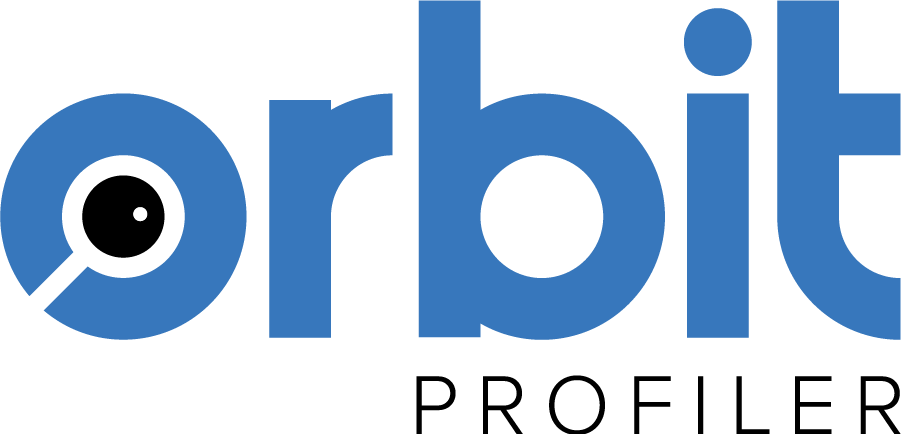
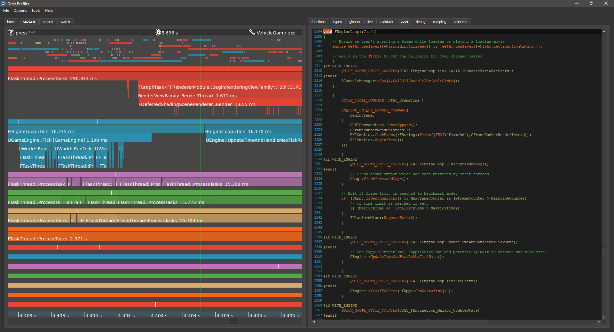

**Download**  
www.orbitprofiler.com

**O**rbit **R**untime **B**inary **I**nstrumentation **T**ool is a standalone **C/C++** profiler for Windows. Its main purpose is to help developers visualize the execution flow of a complex application.

The key differentiator with many existing tools is that no alteration to the target process is necessary. Orbit does not require you to change a single line of code.  It doesn't require you to recompile or even relaunch the application you want to debug. Everything is done seamlessly, right when you need it. It requires zero integration time and zero iteration time.

Orbit analyses the debug information present in the pdb files and performs runtime injection into the target process to open up a communication channel between the two applications.  It can then dynamically instrument functions that the user selects easily from the intuitive UI.  It also contains a robust sampling profiler and context switch tracker based on ETW (Event Tracing for Windows).  Instrumentation data is presented in the form of a flame chart onto which sampling data is overlaid.

**Features**
- No Code Change Required
- Fast Pdb Parsing
- Runtime Injection
- Dynamic Instrumentation (Hooking)
- Robust Sampling (ETW)
- Context Switch Tracking
- Remote Profiling
- Data Tracking
- Variable Tweaking
- Full type information (detailed memory layout, class hierarchy...)
- Portable Executable Files Parsing (PE Parsing)
- Code View
- Disassembly View
- Support for Win32 and x64
- Global Initialization Profiling
- Blazing Fast UI
- Plugin Architecture for custom visualizers
- Data Driven User Sessions
- Full Serialization of Captured Data
- Tested on Unreal, Unity, Lumberyard, Qt, Doom3, PhysX, ...
- Built-in Support For Unreal Types (FNames, UObject)
- "Don’t pay for what you don’t use" (Performance)
- "Show Include" Util
- Diff Util
- and more!

Thank you for using Orbit.

A quick introduction video can be found here:
http://telescopp.com/howto

A more in-depth video can be found here:
www.telescopp.com

**Building**  
The current version of Orbit requires **Visual Studio 2015** and **Qt 5.8**.  Open Orbit.sln, select x64 Release and build.  Don't forget to build the Win32 version of OrbitDll if you want to hook into 32 bit processes.

**Workflow**
1. Select a process in the list of currently running processes in the "Home" tab
2. The list of loaded modules will appear on the bottom of the "Home" tab.  If a .pdb file was found for a module, it will appear in blue
3. Right click on the module(s) for which you want to load debug information and select "Load Pdb".  Wait a little bit for Orbit to parse the pdb.  Once its done, The "Functions", "Types" and "Globals" tabs will get populated.
4. Select functions you wish to profile in the "Functions" tab by right clicking and choosing "Hook"
5. In the "Capture" tab, start profiling by pressing 'X'.  To stop profiling, press 'X' again.  You can zoom time using the scroll wheel.  To zoom vertically, hold 'CTRL' while scrolling.  You can also right-click and drag to zoom time.  Press A to Zoom the last 2 seconds of capture.
6. When you select a function in the "Capture" view, the full callstack will be available in the "Callstack" tab.  You can select functions to be profiled in the callstack tab as well.  Also, if code is available on your machine, it will be displayed in the "Code" tab.
7.  You can select sections of the per-thread sampling event section to get a sampling report of your selection.

Sessions
Once you have loaded the debug information for your modules and have chosen functions of interest, you can save your profiling session so that you won't have to do this manually again.  To save a session, go to "File"->"Save Session"

Questions and comments are more than welcome, please send them directly to pierric.gimmig@gmail.com.

**Pierric Gimmig**  
  

License (BSD 2-clause)
======

	Copyright (c) 2017 Pierric Gimmig. All rights reserved.
	
	https://github.com/pierricgimmig/orbitprofiler
	
	Redistribution and use in source and binary forms, with or without
	modification, are permitted provided that the following conditions are met:
	
	   1. Redistributions of source code must retain the above copyright notice,
	      this list of conditions and the following disclaimer.
	
	   2. Redistributions in binary form must reproduce the above copyright
	      notice, this list of conditions and the following disclaimer in the
	      documentation and/or other materials provided with the distribution.
	
	THIS SOFTWARE IS PROVIDED BY COPYRIGHT HOLDER ``AS IS'' AND ANY EXPRESS OR
	IMPLIED WARRANTIES, INCLUDING, BUT NOT LIMITED TO, THE IMPLIED WARRANTIES OF
	MERCHANTABILITY AND FITNESS FOR A PARTICULAR PURPOSE ARE DISCLAIMED. IN NO
	EVENT SHALL COPYRIGHT HOLDER OR CONTRIBUTORS BE LIABLE FOR ANY DIRECT,
	INDIRECT, INCIDENTAL, SPECIAL, EXEMPLARY, OR CONSEQUENTIAL DAMAGES
	(INCLUDING, BUT NOT LIMITED TO, PROCUREMENT OF SUBSTITUTE GOODS OR SERVICES;
	LOSS OF USE, DATA, OR PROFITS; OR BUSINESS INTERRUPTION) HOWEVER CAUSED AND
	ON ANY THEORY OF LIABILITY, WHETHER IN CONTRACT, STRICT LIABILITY, OR TORT
	(INCLUDING NEGLIGENCE OR OTHERWISE) ARISING IN ANY WAY OUT OF THE USE OF
	THIS SOFTWARE, EVEN IF ADVISED OF THE POSSIBILITY OF SUCH DAMAGE. 
